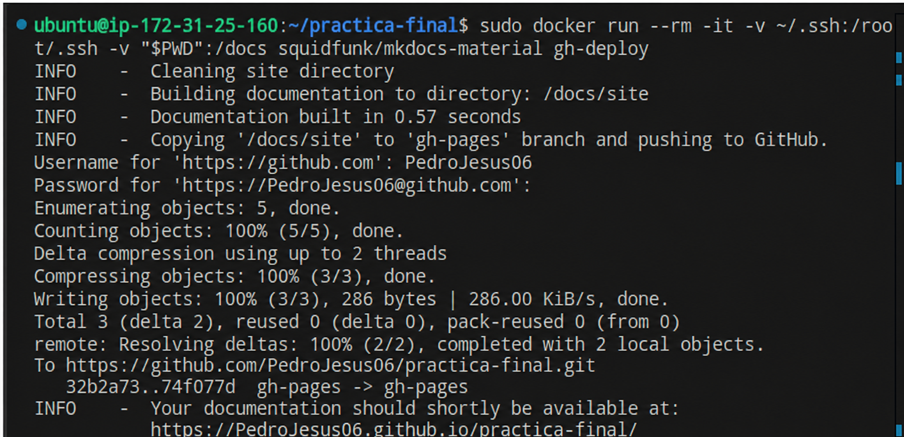
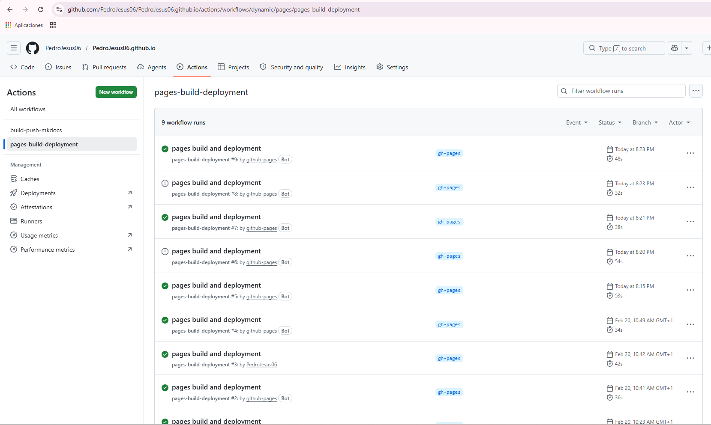
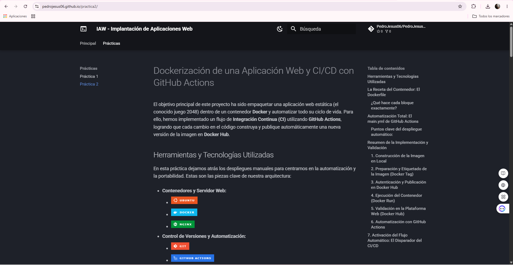

# Creación y Despliegue de Documentación con MkDocs y GitHub Pages

El objetivo de esta práctica ha sido construir un sitio web estático elegante y funcional para alojar la documentación del módulo. En lugar de escribir HTML a mano, hemos utilizado **MkDocs**, una herramienta que transforma nuestros archivos **Markdown** en un sitio web completo. Además, hemos automatizado su publicación para que sea accesible públicamente a través de **GitHub Pages**.

## Herramientas y Tecnologías Utilizadas

Para levantar este proyecto y mantener la documentación organizada, hemos combinado las siguientes tecnologías:

* **Generación y Lenguaje:**
    * 
    * 

* **Control de Versiones y Alojamiento:**
    * 
    * 

## Explicando el `mkdocs.yml`

Todo el aspecto visual, la navegación y las extensiones de nuestro sitio se controlan desde un único archivo de configuración. Hemos utilizado el tema **Material for MkDocs**, personalizándolo a fondo para conseguir un entorno de lectura técnico y cómodo.

Este es el archivo que define la estructura:

```yaml
site_name: IAW - Implantación de Aplicaciones Web
site_description: Documentación y despliegue de prácticas del módulo
site_author: Pedro Jesús Águila Oller

repo_name: PedroJesus06/PedroJesus06.github.io
repo_url: https://github.com/PedroJesus06/PedroJesus06.github.io

theme:
  name: material
  language: es # Todo en español
  
  # Le ponemos un icono de consola de comandos arriba a la izquierda
  icon:
    logo: material/console
  
  # Configuración de colores: Modo oscuro estilo "Matrix/Hacker" y opción de modo claro
  palette:
    # 1. Modo oscuro (Slate)
    - scheme: slate
      primary: black
      accent: cyan # El cyan sobre negro queda espectacular
      toggle:
        icon: material/weather-night
        name: Cambiar a modo claro
    
    # 2. Modo claro (Por si alguien prefiere que no le quemen los ojos de día)
    - scheme: default
      primary: black
      accent: teal
      toggle:
        icon: material/weather-sunny
        name: Cambiar a modo oscuro

  # Funcionalidades extra del tema (pestañas, botón de volver arriba, etc.)
  features:
    - navigation.tabs # Pestañas arriba
    - navigation.tabs.sticky # Las pestañas te persiguen al hacer scroll
    - navigation.top # Botón de la flechita para volver arriba del todo
    - content.code.copy # ¡IMPORTANTÍSIMO! Botón de "Copiar" en los bloques de código

# Extensiones de Markdown para que el código y las notas se vean de locos
markdown_extensions:
  - admonition # Para poner cajitas de "Nota", "Peligro", "Info"
  - pymdownx.details # Para hacer cajitas desplegables
  - pymdownx.superfences # Necesario para que los bloques de código se rendericen perfectos
  - pymdownx.highlight: # Resaltado de sintaxis (colores en el código)
      anchor_linenums: true

# Menú de navegación con iconos para darle rollo
nav:
  - Principal: index.md
  - Prácticas:
      - Práctica 1: practica1.md
      - Práctica 2: practica2.md
```

### ¿Qué aporta esta configuración?

* **Esquema de Colores Dual:** Implementamos un modo oscuro por defecto (`slate`) con acentos en cyan para reducir la fatiga visual al leer código, añadiendo un botón interactivo (`toggle`) para alternar al modo claro.
* **Navegación Fluida:** Las características (`features`) activan pestañas fijas al hacer scroll y añaden utilidades cruciales, como el botón de **copiar al portapapeles** integrado directamente en los bloques de código.
* **Extensiones Avanzadas:** Utilizamos complementos como `admonition` y `superfences` para romper la monotonía del texto plano, permitiendo crear cajas de advertencia, menús desplegables y un resaltado de sintaxis impecable para diferentes lenguajes de programación.

## Resumen de la Implementación y Validación

El proceso de creación y despliegue consta de tres fases fundamentales: desarrollo local, control de versiones y subida a producción.

### 1. Servidor de Desarrollo en Local

Antes de publicar nada, necesitamos ver cómo queda el sitio. Utilizamos el servidor integrado de MkDocs para compilar el Markdown en tiempo real y hacer pruebas.

> *Lanzando el servidor local*

Al ejecutar el comando **`mkdocs serve`**, la herramienta procesa nuestros archivos y levanta un servidor de pruebas ligero en nuestra máquina. Esto nos permite ver los cambios en el navegador (en el puerto **8000**) de forma instantánea cada vez que guardamos un archivo `.md`.



### 2. Control de Versiones y Despliegue en GitHub

Una vez que el contenido está listo y validado en local, toca subir el código fuente al repositorio y ordenar a MkDocs que compile la versión definitiva para producción.

> *Subida de código fuente y ejecución del despliegue*

En un flujo continuo dentro de la terminal, realizamos dos acciones críticas:
1.  Hacemos un **`git push`** para respaldar nuestros archivos Markdown y el `mkdocs.yml` en la rama principal (`main`).
2.  Ejecutamos **`mkdocs gh-deploy`**. Este comando es el verdadero motor de la práctica: compila el sitio estático, crea una rama huérfana llamada `gh-pages` en nuestro repositorio y sube todo el HTML generado allí de forma totalmente automática.



### 3. Resultado Final: Documentación en Producción

El último paso es comprobar que **GitHub Pages** ha interceptado esa nueva rama `gh-pages` y está sirviendo el sitio correctamente a través de internet.

> *Sitio web desplegado y funcional*

Accedemos a nuestra URL pública y comprobamos que el tema **Material**, el modo oscuro con acentos cyan y el menú de navegación estructurado cargan a la perfección. La documentación queda asegurada, estéticamente pulida y disponible globalmente.


